# Voice Agent POC — Open-Source Stack on Azure



Multilingual voice agent supporting **Arabic · French · English**  
Fully open-source, runs entirely within Azure Qatar Central — no data leaves the region.

## Stack

| Layer | Service | Image |
|---|---|---|
| WebRTC | LiveKit | `livekit/livekit-server` |
| STT | Whisper large-v3 | `onerahmet/openai-whisper-asr-webservice` |
| TTS | Coqui XTTS-v2 | `ghcr.io/coqui-ai/tts` |
| LLM | Ollama (Llama 3 / Mistral / Qwen) | `ollama/ollama` |
| Orchestration | FastAPI + LangChain | `./langchain-api` (build locally) |
| Vector DB | Qdrant | `qdrant/qdrant` |
| Conversation store | MongoDB 7 | `mongo:7` |
| Object storage | MinIO | `minio/minio` |
| Session cache | Redis 7 | `redis:7-alpine` |
| Proxy | Nginx | `nginx:alpine` |

---

## Quick Start

### 1. Prerequisites

- Docker Desktop (Mac/Windows) or Docker Engine + Compose plugin (Linux)
- 16 GB RAM minimum (32 GB recommended for `large-v3` Whisper + Llama 3)
- NVIDIA GPU optional but strongly recommended for LLM inference speed

### 2. Clone and configure

```bash
cp .env.example .env
# Edit .env — change all passwords and secrets
```

### 3. Start the stack

```bash
# Pull all images first (saves time)
docker compose pull

# Start everything
docker compose up -d

# Watch logs
docker compose logs -f
```

### 4. Pull the LLM model

The `ollama-model-loader` service does this automatically, but you can also do it manually:

```bash
# Default: Llama 3.1 (best all-round)
docker exec voice_ollama ollama pull llama3.1

# Alternative: Qwen 2.5 (better Arabic)
docker exec voice_ollama ollama pull qwen2.5

# Alternative: Aya (purpose-built multilingual)
docker exec voice_ollama ollama pull aya

# Embedding model (required for RAG)
docker exec voice_ollama ollama pull nomic-embed-text
```

### 5. Verify all services are healthy

```bash
docker compose ps
```

All services should show `healthy` or `running`.

---

## Service URLs

| Service | URL | Notes |
|---|---|---|
| Orchestration API | http://localhost/api/ | Main entry point |
| API docs (Swagger) | http://localhost:8000/docs | Direct to FastAPI |
| Whisper | http://localhost:9000/docs | STT API |
| Ollama | http://localhost:11434 | LLM API |
| Qdrant dashboard | http://localhost:6333/dashboard | Vector DB UI |
| MinIO console | http://localhost:9001 | Object storage UI |

---

## API Usage Examples

### Create a session

```bash
curl -X POST http://localhost/api/sessions \
  -H "Content-Type: application/json" \
  -d '{"preferred_language": "ar"}'
```

### Send a text turn

```bash
curl -X POST http://localhost/api/turn \
  -H "Content-Type: application/json" \
  -d '{
    "session_id": "YOUR_SESSION_ID",
    "text": "مرحبا، كيف يمكنني مساعدتك اليوم؟",
    "language": "ar"
  }'
```

### Send audio (voice turn)

```bash
curl -X POST "http://localhost/api/voice-turn?session_id=YOUR_SESSION_ID" \
  -F "audio=@/path/to/audio.wav"
```

### Transcribe audio only (STT)

```bash
curl -X POST "http://localhost:9000/asr?encode=true&task=transcribe&language=ar" \
  -F "audio_file=@/path/to/audio.wav"
```

---

## GPU Support

For GPU acceleration (strongly recommended for Whisper large-v3 and LLM):

1. Install NVIDIA Container Toolkit: https://docs.nvidia.com/datacenter/cloud-native/container-toolkit/install-guide.html
2. In `docker-compose.yml`, uncomment the `deploy.resources` blocks in `whisper`, `ollama`, and `tts` services.
3. Restart: `docker compose up -d`

---

## Arabic-Optimised LLM Options

| Model | Pull command | Arabic quality | Size |
|---|---|---|---|
| Llama 3.1 8B | `ollama pull llama3.1` | Good | 4.7 GB |
| Qwen 2.5 7B | `ollama pull qwen2.5` | Very good | 4.4 GB |
| Aya 8B | `ollama pull aya` | Very good | 4.8 GB |
| Mistral 7B | `ollama pull mistral` | Good | 4.1 GB |

Change `OLLAMA_MODEL` in `.env` and restart the `langchain-api` service:
```bash
docker compose restart langchain-api
```

---

## Stop / Clean up

```bash
# Stop all services (keep data volumes)
docker compose down

# Stop and remove all data volumes (full reset)
docker compose down -v
```

---

## Next Step: Deploy to Azure AKS (Qatar Central)

1. Push all images to **Azure Container Registry** (`az acr build`)
2. Convert this `docker-compose.yml` to Helm charts using `kompose convert`
3. Deploy to AKS in `qatarcentral` with GPU node pools
4. See `helm/` directory (coming next) for the production Helm chart
